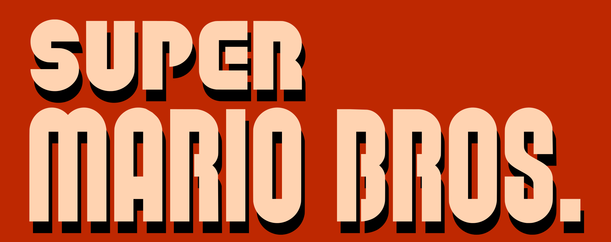

## [Play Now!](https://tylerreichle.github.io/mario_js/)

# Level 1-1 in JavaScript

 Mario runs through each level trying to reach the castle on the other side to save the princess. Each level contains various enemies, coins to collect, and mushrooms to power-up Mario. Mario's primary form of attack is jumping on top of enemies but touching enemies from the sides results in loss of a life.

 ## Controls

| Action     | Key Input                       |
|:----------:|:-------------------------------:|
| Move Left  | 'A' / Left-Arrow               |
| Move Right | 'D' / Right-Arrow              |
| Jump       | 'W' / Spacebar / Up-Arrow      |

## Technologies Used

Super Mario Bros JS was build using the following technologies:

- Vanilla JavaScript (No Libraries used) and a minified version of jQuery used for overall structure and game logic.

- A HTML5 Canvas used for rendering of the current game state and all game entities.

- Webpack used to bundle and serve up the various scripts in the correct order.

## Technical Details

**game.js**: Game contains be the main game loop and handles initial game setup. This class holds the HTML5 canvas used for main game view as well as all the entities currently in the level. UpdateView handles updating the viewport to follow Mario throughout the level.

The complete game is rendered and updated using five helper scripts inside of the main game loop. Each is called 60 times per second creating a smooth playing experience for the user.

**animation.js**: Helper used for looping through calling the animation method of each entity in the game after user input.

**input.js**: Helper function that handles listening for user input and passing on that to the game state. Mario's current state (standing, walking, jumping) set by which keys are currently pressed.

**movement.js**: Movement controls enemy movement and updates the game state with Mario's current velocity and direction based on player input.

**physics.js**: Physics handles all collision detection between game entities including Mario, enemies, and the map terrain. After detecting a collision between entities it determines the effects of the collision based on the two entity types. Physics also applies gravity to all entities.

**render.js**: Render will draw each game entity onto the main canvas along with drawing the hud onto the canvas. Render also holds all scenery entities loaded by the map builder. Render will only draw entities currently in the viewport, preventing unnessesary usage of resources and memory.

## Bonus features
There are many additional feature that could be added in the future. Some anticipated updates are:

- Add the ability to grab flower power-ups and shoot fireballs at enemies
- Underground portion of level
- Multiple levels and additional enemy types.
