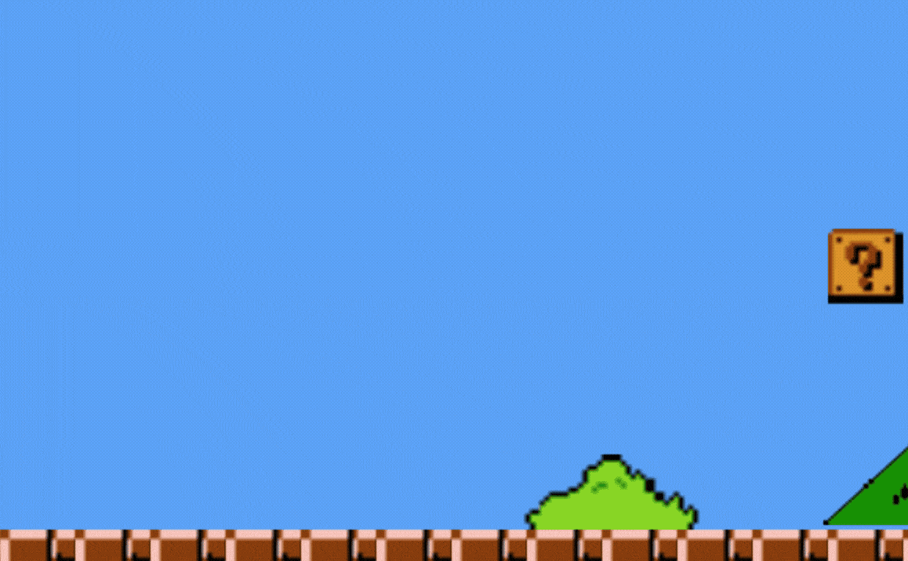
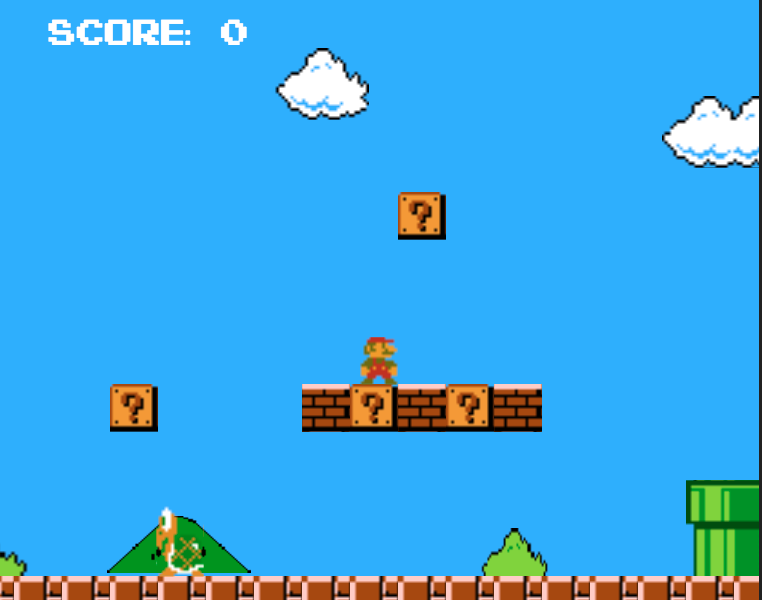
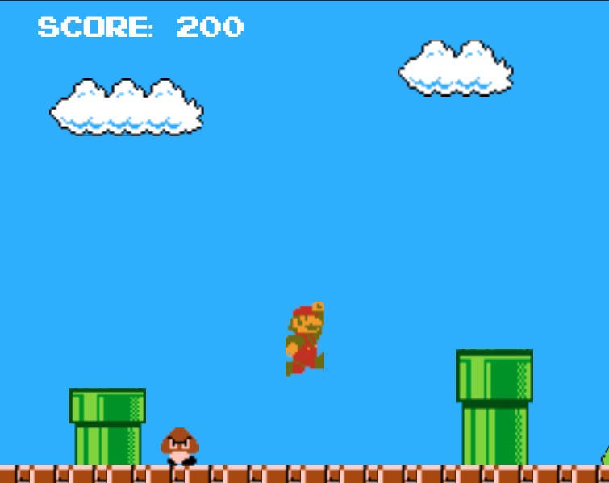

# Mario JS

[](http://makeapullrequest.com)

### Super Mario Bros Level 1-1 recreated in JavaScript

## [Play Now!](https://tylerreichle.github.io/mario_js/)

 Mario runs through each level trying to reach the castle on the other side to save the princess. Each level contains various enemies, coins to collect, and mushrooms to power-up Mario. Mario's primary form of attack is jumping on top of enemies but touching enemies from the sides results in loss of a life.



 ## Controls

| Action     | Key Input                       |
|:----------:|:-------------------------------:|
| Move Left  | 'A' / Left-Arrow                |
| Move Right | 'D' / Right-Arrow               |
| Jump       | 'W' / Spacebar / Up-Arrow       |

## Technologies Used

Mario JS was build using the following technologies:

- Vanilla JavaScript used for overall game structure and logic.

- Minified version of jQuery used to detect user input.

- A HTML5 Canvas used for rendering of the current game state and all game entities.

- Webpack used to bundle and serve up the various scripts in the correct order.




## Technical Details

Game viewport updates to follow Mario based of his current x-position on the canvas. Render will only draw entities currently in the viewport, preventing unnessesary usage of resources and memory.

```javascript
// game.js
static updateView(data) {
  const viewport = data.viewport;
  const margin = viewport.width / 6;
  const center = {
    x: data.entities.mario.xPos + (data.entities.mario.width * 0.5),
    y: data.entities.mario.yPos + (data.entities.mario.height * 0.5),
  };

  if (center.x < viewport.vX + (margin * 2)) {
    viewport.vX = Math.max(center.x - margin, 0);
  } else if (center.x > (viewport.vX + viewport.width) - (margin * 2)) {
    viewport.vX = Math.min((center.x + margin) - viewport.width, 3400 - viewport.width);
  }
}

// render.js
drawEntity(entity, data) {
  if (((entity.xPos + entity.width >= data.viewport.vX &&
        entity.xPos + entity.width <= data.viewport.vX + data.viewport.width)) &&
      ((entity.yPos + entity.height >= data.viewport.vY &&
        entity.yPos + entity.height <= data.viewport.vY + data.viewport.height))) {
      // draw entity to screen
    }
  }
```

Entities are animated by looping through and drawing a series sprites similar to a flipbook. SpriteAnimations object holds groups of sprites corresponding to each state an entity could be in such as walking, jumping, squashed, or dying. An entity's currentState is updated depending on changes to x and y velocity as well as collisions with other entities in the game.

```javascript
// coin.js
this.spriteAnimations = {
  spin: {
    frames: [
      new Sprite(spriteSheet, 5, 5, 10, 14),
      new Sprite(spriteSheet, 21, 5, 10, 14),
      new Sprite(spriteSheet, 37, 5, 10, 14),
      new Sprite(spriteSheet, 53, 5, 10, 14),
    ],
    currentFrame: 0,
  }

this.states = {
  spinning: {
    animation(data) {
      if (data.animationFrame % 13 === 0) {
        self.sprite =
          self.spriteAnimations.spin.frames[self.spriteAnimations.spin.currentFrame];
        self.spriteAnimations.spin.currentFrame += 1;

        if (self.spriteAnimations.spin.currentFrame > 3) {
          self.spriteAnimations.spin.currentFrame = 0;
        }
      }
    },
  },
```

MapBuilder was designed with the goal of allowing easy addition of levels after the completion of the project. Data for each level is stored in an object containing all the locations of scenery entities and enemy spawn points.

When the main Game class is initialized it creates and instance of MapBuilder loading in the current level. MapBuilder then creates the appropriate scene and enemy entities for the current level and begins rendering them to the canvas.

```javascript
// game.js
mapBuilder: new MapBuilder(levelOne, tileset, spriteSheet),

// mapBuilder.js
level.ground.forEach((ground) => {
  this.sceneryEntities.push(
    new Scenery.Ground(this.tileset, ground[0], ground[1], ground[2], ground[3]),
  );
});

level.pipes.forEach((pipe) => {
  this.sceneryEntities.push(
    new Scenery.Pipe(this.tileset, pipe[0], pipe[1], pipe[2], pipe[3]),
  );
});

renderMap(data) {
  this.sceneryEntities.forEach((scene) => {
    this.drawEntity(scene, data);
  });

  this.brickEntities.forEach((brick) => {
    this.drawEntity(brick, data);
  });
```



## Bonus features
There are many additional feature that could be added in the future. Some anticipated updates are:

- Add the ability to grab flower power-ups and shoot fireballs at enemies.
- Underground portion of level.
- Multiple levels and additional enemy types.
